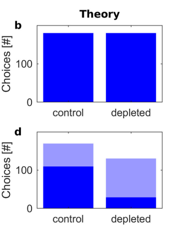

Implementation of the paper: Möller, M., & Bogacz, R. (2019). Learning the payoffs and costs of actions. 
In PLoS Computational Biology (Vol. 15, Issue 2). https://doi.org/10.1371/journal.pcbi.1006285

## Run

### make_fig6.py
Recreate fig. 6 from the paper

|                            |  Pellet | Chow |
|----------------------------|:-------:|------|
| **Control**                |         |      |
| Replication                | 1.05    | 0.45 |
| Fig 6                      | 1.0     | 0.4  |
| **D2R Depleted**           |         |      |
| Replication                | -0.5704 | 0.45 |
| Fig 6                      | -0.6    | 0.4  |

### make_fig8.py
Recreate fig. 8 from the paper

Replication of fig. 8:

Original fig. 8 from the paper:
