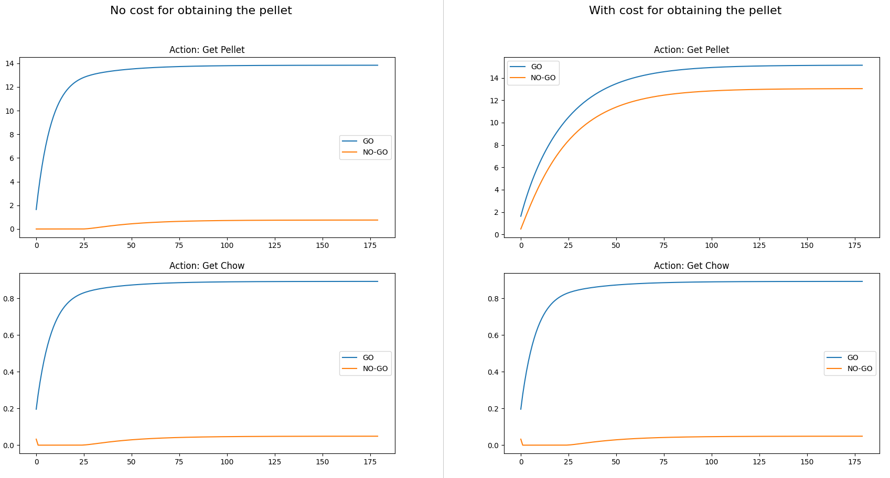

Implementation of the paper: Möller, M., & Bogacz, R. (2019). Learning the payoffs and costs of actions. 
In PLoS Computational Biology (Vol. 15, Issue 2). https://doi.org/10.1371/journal.pcbi.1006285

## make_fig6.py

#### Replication of fig. 6 from the paper

|                            |  Pellet | Chow |
|----------------------------|:-------:|------|
| **Control**                |         |      |
| replication                | 1.05    | 0.45 |
| fig 6                      | 1.0     | 0.4  |
| **D2R Depleted**           |         |      |
| replication                | -0.5704 | 0.45 |
| fig 6                      | -0.6    | 0.4  |

## make_fig8.py

#### Replication of fig. 8 from the paper:

  * Left: original (partial) fig. 8 from the paper
  * Right: replicated fig. 8

#### Show GO/NO-GO values for different experimental conditions:

Values of GO/NO-GO populations for a single run (single rat):
* left column: no cost for obtaining the pellet
* right column: with cost for obtaining the pellet
* first row: go for pellet action
* second row: go for chow action